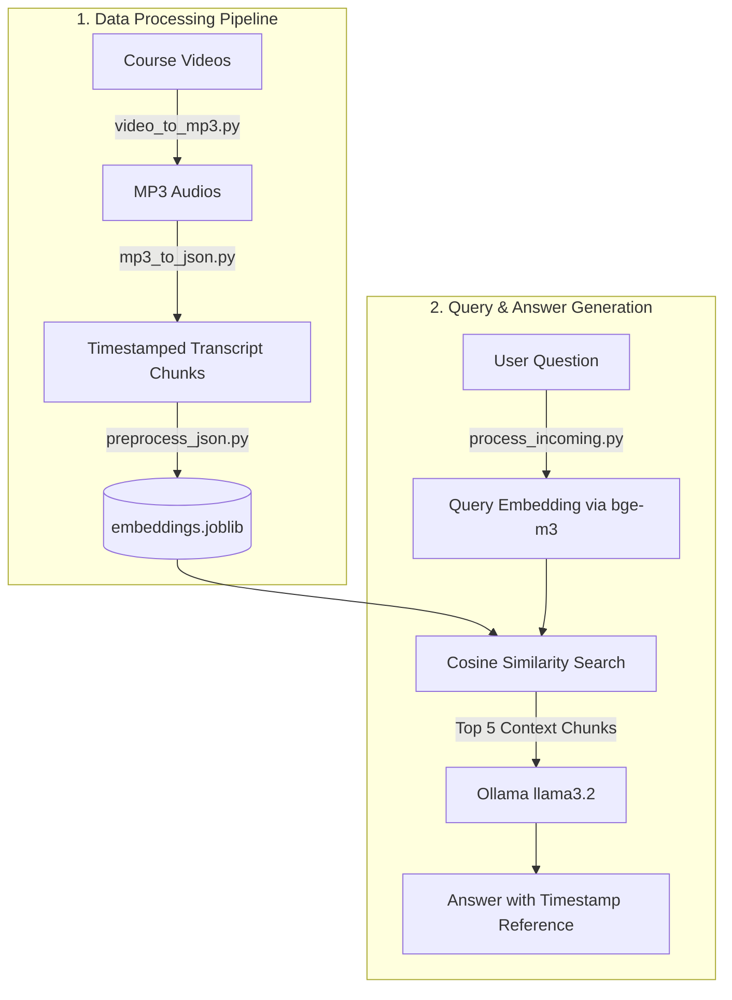

# RAG-based AI Teaching Assistant

A local Retrieval-Augmented Generation (RAG) assistant for video courses. It transcribes video lectures, generates vector embeddings for timestamped segments, and answers user questions with the exact video and timestamp where the topic is taught.

---

## System Flow



---

## How It Works

The project consists of 4 core steps:

1. **`video_to_mp3.py` (Audio Extraction)**  
   Extracts audio streams from video lectures into `.mp3` format using FFmpeg.

2. **`mp3_to_json.py` (Transcription & Translation)**  
   Uses OpenAI Whisper (`large-v2`) to transcribe Hindi audio, translate it into English, and slice it into timestamped JSON chunks (`start`, `end`, `text`, `title`, `number`).

3. **`preprocess_json.py` (Vector Embeddings)**  
   Sends chunk text to a local Ollama instance running `bge-m3` to generate 1024-dimensional dense vector embeddings. Stores chunks and vectors in `embeddings.joblib`.

4. **`process_incoming.py` (Search & Inference)**  
   Takes a user query, generates its embedding via `bge-m3`, calculates Cosine Similarity against all indexed chunks using Scikit-Learn, retrieves the top 5 matches, and prompts `llama3.2` to generate a response pointing directly to the video and timestamp.

---

## Tech Stack

- **Speech-to-Text**: OpenAI Whisper (`large-v2`)
- **Embedding Model**: `bge-m3` (via local Ollama)
- **Language Model**: `llama3.2` (via local Ollama)
- **Vector Search**: Scikit-Learn (`cosine_similarity`), NumPy, Pandas
- **Storage**: Joblib (`embeddings.joblib`)
- **Media Processing**: FFmpeg
- **Language**: Python 3.9+

---

## How to Run

### 1. Prerequisites
- Install **Python 3.9+** and **FFmpeg**.
- Install and start [Ollama](https://ollama.com/), then pull the models:
  ```bash
  ollama pull bge-m3
  ollama pull llama3.2
  ```

### 2. Setup
```bash
git clone https://github.com/mdrayan001/RAG-based-AI-Teaching-Assistant.git
cd RAG-based-AI-Teaching-Assistant

pip install openai-whisper requests pandas numpy scikit-learn joblib torch
```

### 3. Pipeline Execution
Run the scripts in sequence:
```bash
python video_to_mp3.py        # Extract audio from videos/
python mp3_to_json.py         # Transcribe audio to jsons/
python preprocess_json.py     # Create embeddings.joblib
python process_incoming.py    # Query the assistant via CLI
```

---

## Example

**Question:**
> *"Where is HTML concluded in this course?"*

**Generated Response:**
```text
HTML is concluded in Video 13: "Entities, Code tag and more on HTML".

- Video 13 (at timestamp 520.32s / 08:40) officially concludes the HTML topics.
- Video 14 (at timestamp 05.28s) confirms HTML is finished and transitions into CSS.
```

---

## Project Files

```plaintext
├── video_to_mp3.py       # Converts video files to MP3 using FFmpeg
├── mp3_to_json.py        # Transcribes & translates MP3 to timestamped JSON
├── preprocess_json.py    # Embeds chunks with bge-m3 and saves DataFrame
├── process_incoming.py   # CLI query interface, vector search & LLM inference
├── embeddings.joblib     # Precomputed vector store
├── jsons/                # Transcript chunks with start/end seconds
├── rag_all_audios/       # Extracted MP3 files
├── rag_sample-videos/    # Sample video files
├── prompt.txt            # Last assembled RAG prompt
└── response.txt          # Last generated response
```

---

## License

MIT License
